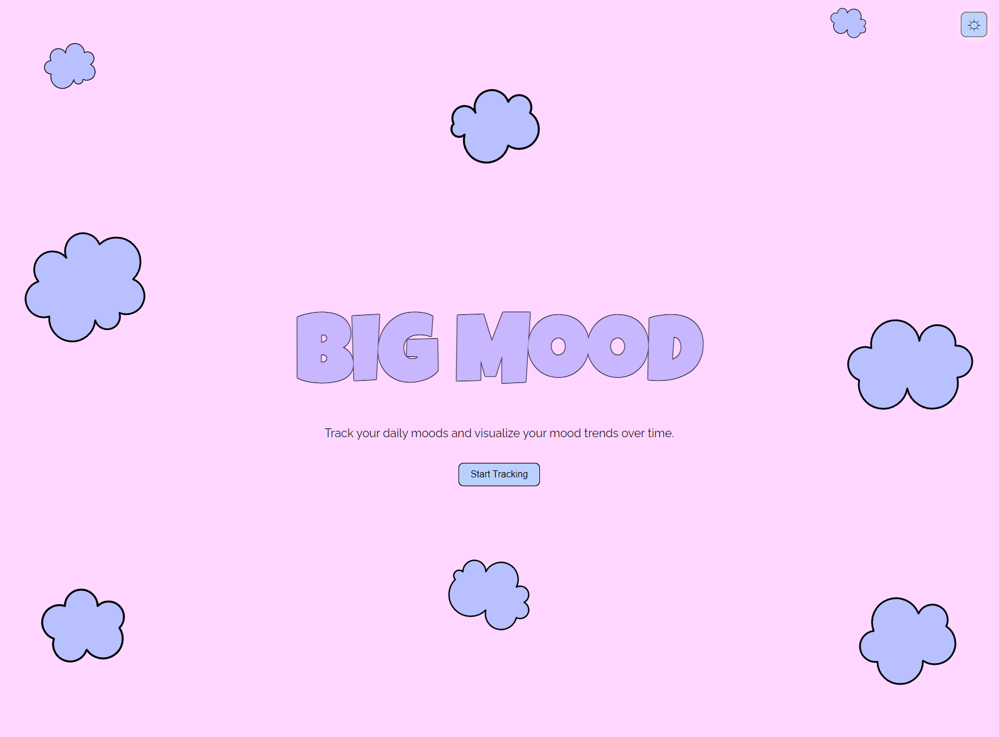

# Big Mood

Big Mood is a web application that allows users to log their daily mood and visualize mood trends using a color-coded calendar. Users can navigate between months to view past moods.

## Screenshots



## Features

- Log daily mood with a simple mood selector.
- View mood trends on a color-coded calendar.
- Navigate between months to view past moods.
- Mood data is stored locally for persistence.

## Getting Started

Follow these instructions to get a copy of the project up and running on your local machine.

### Prerequisites

You need a web browser to run this project.

### Installation

1. Clone the repository:

   ```bash
   git clone https://github.com/breebreezy23/big-mood.git

2. Navigate to the project directory:

    ```bash
    cd big-mood

3. Open index.html in your web browser:

    ```bash
    open index.html

### Usage
-Select a day on the calendar by clicking on it.
-Choose your mood from the dropdown menu.
-Click the "Save Mood" button to log your mood.
-Navigate between months using the "<" and ">" buttons to view past moods.

### Project Structure
- index.html: The main HTML file that contains the structure of the web app.
- styles.css: The CSS file for styling the web app.
- script.js: The JavaScript file that contains the logic for mood tracking and calendar navigation.

### Mood Colors
Happy: Yellow
Sad: Blue
Neutral: Grey
Angry: Red
Excited: Orange

### Future Improvements
Implement year navigation to view moods from different years.
Add more sophisticated mood analysis and trend visualization features.
Enhance the user interface with animations and additional visual feedback.

### Contributing
Feel free to submit issues and enhancement requests.
